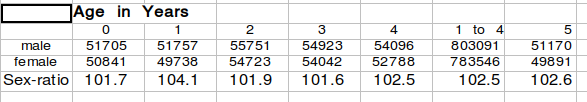

```{r setup, include=FALSE}
knitr::opts_chunk$set(echo = TRUE)
```

Absent a recent catastrophe, the number of infants (less than one-year old) in a population is somewhat larger than the number of one-year-olds. On occasion, census data have the number of infants less than the number of one-year-olds; this is usually a reflection of age-heaping at age one, or of under-reporting of infants. More generally, sex-differences in age-heaping can distort sex ratios, raising important issues of interpretation. For example, New York state in 1860 features male-biased age-heaping of infants into age 1, pushing down the measured SR1 and pushing up the measured SR1-2 (and related aggregate ratios, most importantly the SR0-4). Aggregating the SR1 and SR1-2 corrects for the age-heaping, with the SR0-2 providing an indication of maternal and infant well-being.  
<br>
<br>
 The *Population* volume of the US Census reports "population by age and sex" for "under 1" and "1 and under 5" and for a series of 5-year and 10-year age-groups. For NY state, the published data give an SR1 value of 101.8, distinctly less than the 102.6 value of the SR1to5. Taken at face value, the relatively low SR1 might suggest bad maternal and infant living conditions in the year before the census (or perhaps female-biased mortality among children, boosting the child-sex ratio). However, digging into the census data reveals a problem of male-biased age-heaping of infants at age 1. Using the PUMS full count dataset, we can break out children's populations at one-year intervals, which reveals an anomalously high SR1-2 value of 104.1 while the other years-of-age the sex-ratio values fall in a narrow range from 101.6 to 102.6 .  In our view, the sex-ratio information in these data are obscured by the age-heaping at age one-year, which has a slight male bias. Some support for this view comes from the counts at infants at months of age, with just 4522 infants in the 11-month-old group and 7615 infants in the next smallest group, the seven-month olds (unsurprisingly, the numbers pile up at 6-months old, where we find 13,647 infants; the next largest group is the 3-month-olds, with 11,368 infants). And among 11-month olds, the sex-raio is only 98.0, suggesting that relatively more males than females were subject to rounding up from 11-months to one-year when their ages were enumerated. Pooling the infants and one-year-olds largely corrects for the effects of sex-biased age-heaping, revealing a more credible sex-ratio pattern, with the SR0-2 being 102.9 an the SR0-4 being 102.0.  Those sex-ratios are roughly typical of healthy populations of the mid-19th century (lower than we now see, having driven infant mortality down to less than 1% in OECD countries). 
     
**NY State, 1860: Infant and Young-child Sex Ratios**

```{r jim1, echo=FALSE, out.width = '70%'}

```  
<br>
**Source** [1860 PUMS full-count](https://usa.ipums.org/usa/sampdesc.shtml#us1860c)
<br>
<br>
We have access to the full-count census data for New York at the level of individual enumeration district, which enables us to better identify the role of selective age-heaping in these data. Districts with more one-year-olds than infants are deemed to have age-heaping (of infants into the one-year age-group). Within the age-heaping districts, the age-one sex-ratio was a whopping 106.3, which was substantially above the infant sex-ratio's 102.1 value.  Thus looking at the enumeration-district level of data points to the need to look at sex-ratio values across adjacent ages. To the extent that 11-month-old boys tended to be enumerated as one-year olds, the infant sex-ratio will be biased down and the one-year sex ratio will be biased up, with the opposing biases of similar magnitudes. But aggregating the infant and age-one counts will eliminate that source of bias (while adding other sorts of error?)
  
NOTE: As a check, we restrict attention to enumeration districts with at least 70 infants, eliminating very small counts in which random variation in the SR1 could obscure patterns of interest. Restricting attention to those districts at least 70 infants, within the age-heaping districts the age-one sex-ratio was 106.7 and the infant sex-ratio was just 102.1. So we get the same basic result whether or not we restrict attention to districts with at least 70 infants.

